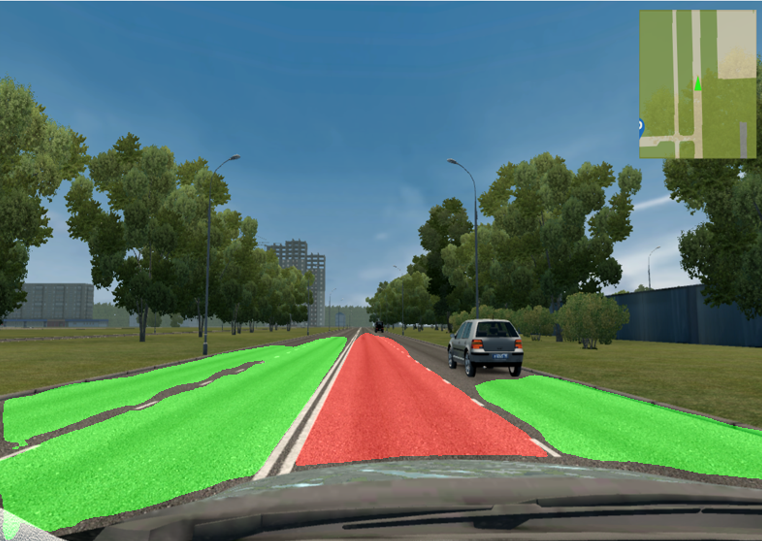

# Детекция полос движения автотранспорта

Проект является пробным применением сверточной сети для
решения задачи поиска и выделения полос движения транспорта.
В качестве опорного был выбран существующий проект (<https://github.com/sunggukcha/deeplabs>)

В реализации используется CNN - DeepLabv3 с разлиными backbones, а 
также обучаемая на разных датасетах.

Для собственных целей был оставлен backbone - ResNet, датасет для 
обучения - bdd100k.

### Результаты обучения модели
Модель, обученная на датасете bdd100k (представляющем собой реальные фото
дорожной ситуации с разметкой полос), была протестирована
в игровом автосимуляторе вождения City Car Driving.

1. Простая ситуация выделения своей полосы и смежной (встречной)
 
2. Ситуация разметки перекрестка (результат адекватен, поскольку
на перекрестке автомобиль может двигаться в различных направлениях)
 
3. Ситуация с изгибами полосы движения (другие алгоритмы "ломаются" на 
данной проверке)
 
4. Выделение своей полосы, а также множества смежных (приемлимый результат)
 
